# TelePoint ✨

<div align="center">

<a href="https://github.com/biswajitkhanra/telepoint">
  
</a>

<br />


<br />

[](https://github.com/biswajitkhanra/telepoint)


</div>

> Premium EMI collection, retailer management, and customer finance workflows built with Next.js, Supabase, and a mobile-first customer experience.

## ✨ Why TelePoint?

TelePoint helps lending teams and retailers manage EMI schedules, customer follow-ups, approval flows, collections, and mobile-first reminders without a clunky legacy workflow.

| | Workflow | What it unlocks |
|---|---|---|
| 💸 | **EMI tracking** | Real-time schedules and fine calculation |
| 📊 | **Operations dashboards** | Retailer portfolios and collection insights |
| 🔔 | **Smart reminders** | Customer broadcasts and follow-up flows |
| 📱 | **Customer access** | EMI visibility from a mobile-first portal |
| 🧾 | **Audit-ready operations** | Backups, logs, exports, and reporting |

## 🎬 A real-image animated preview

The hero above is a repository-hosted animated SVG that crossfades through real finance and payment photography, then layers TelePoint branding and motion on top. It gives the README a living product feel while keeping the asset versioned with the project.

> **Note:** The preview uses fixed Unsplash image URLs for the photographic frames. Replace them with approved product screenshots or self-hosted images in `public/telepoint-animated-hero.svg` when branding or privacy requirements call for it.

## 🚀 Live experience

- ✨ Animated gradient hero and floating accents
- 💎 Glassmorphism cards and premium UI polish
- 🚀 Fast customer and retailer onboarding flows
- 📲 Mobile-ready layout for everyday field use

## 🧱 Tech stack

- Next.js 14 and React 18
- TypeScript and Tailwind CSS
- Framer Motion
- Supabase SSR + Postgres
- Expo / React Native for the mobile app

## 📁 Project structure

```text
telepoint/
├── app/                    # Next.js app router pages and API routes
├── components/             # Reusable UI blocks and dashboards
├── lib/                    # Utility logic, formatters, motion config, auth helpers
├── public/                 # Static assets, branding, and README hero
├── mobile/                 # Standalone Expo Android app
├── backups/                # Automated database backup snapshots
├── backup/                 # Backup docs and setup workflows
├── docs/                   # Additional documentation and notes
├── middleware.ts           # Request middleware
├── package.json            # Web app dependencies and scripts
└── README.md               # This file
```

## ⚡ Quick start

### Web app

```bash
npm install
npm run dev
```

Then open `http://localhost:3000`.

### Mobile app

```bash
cd mobile
npm install
npm start
```

## 🔐 Environment variables

Create a local environment using your Supabase project values:

```bash
NEXT_PUBLIC_SUPABASE_URL=your-supabase-url
NEXT_PUBLIC_SUPABASE_ANON_KEY=your-anon-key
SUPABASE_SERVICE_ROLE_KEY=your-service-role-key
NEXT_PUBLIC_APP_URL=http://localhost:3000
```

## 🔄 Core workflows

- Admin portal for loan approval and operation oversight
- Retailer dashboard for customer portfolios and collections
- Customer EMI portal for account visibility and checklists
- Broadcast messaging and reminder systems
- CSV/export and full backup flows for operational resilience

## 📚 Documentation

- `mobile/README.md` — mobile app documentation and deployment notes
- `backup/README.md` — secure database backup instructions
- `backups/README.md` — stored backup snapshot notes
- `docs/` — supporting operational and product docs

## 🎨 Design direction

TelePoint aims for a premium, trustworthy fintech feel: deep navy and metallic blue surfaces, soft glass layers, deliberate motion, and human visual accents without sacrificing clarity.

## Status

This repository is actively shaped around a full EMI management and collection platform with both web and mobile touchpoints.

---

Built with ❤️ for a premium fintech workflow experience.
