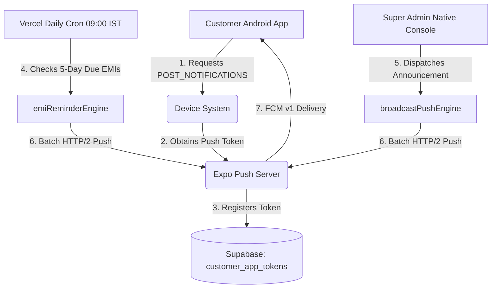

# Telepoint EMI — Production Notification Setup Guide
## Complete Guide for Firebase Cloud Messaging (FCM v1), Expo Push Notifications, and Vercel Cron Automation

---

## 1. Architecture Overview

Telepoint EMI uses a bank-grade push notification pipeline designed for standalone Android APK distribution without Google Play Store dependencies.



| Component | Responsibility | Frequency / Trigger |
|---|---|---|
| **Android Client** (`mobile/`) | Requests permission, registers token on login, unregisters on logout | App startup & auth state changes |
| **Push Token Storage** | Tables `customer_app_tokens` and `notification_deliveries` | Realtime Supabase PostgreSQL |
| **EMI Reminder Engine** | Identifies EMIs maturing in ≤ 5 days, computes exact fine & first charge, prevents duplicates with deterministic idempotency keys | Daily at 09:00 AM IST via Vercel Cron |
| **Admin Push Broadcast** | Dispatches instant push announcements from Native Admin Console or Web Portal | On-demand 1-tap dispatch |

---

## 2. Google Firebase FCM v1 Configuration (for Standalone APK)

For standalone Android APKs distributed directly (sideloaded), Android requires Firebase Cloud Messaging (FCM v1) to deliver push notifications when the app is closed or in background.

### Step 2.1 — Create Firebase Project
1. Open the [Firebase Console](https://console.firebase.google.com/).
2. Click **Add Project** and name it `Telepoint EMI` (or select your existing project).
3. Disable Google Analytics (optional, not needed for push) and click **Create Project**.

### Step 2.2 — Register Android App
1. In the Firebase Project Overview, click the **Android icon** to add an Android app.
2. Enter the exact Android package name configured in `mobile/app.json`:
   ```
   com.telepoint.customer
   ```
3. App nickname: `Telepoint EMI App`.
4. Click **Register App**.

### Step 2.3 — Download `google-services.json`
1. Download the `google-services.json` file from Firebase.
2. Place `google-services.json` directly into the `mobile/` directory:
   ```
   mobile/
   ├── google-services.json  <-- Place here
   ├── app.json
   ├── eas.json
   └── src/
   ```
3. In `mobile/app.json`, ensure the `googleServicesFile` entry is set under `android`:
   ```json
   "android": {
     "package": "com.telepoint.customer",
     "googleServicesFile": "./google-services.json",
     "permissions": [
       "RECEIVE_BOOT_COMPLETED",
       "VIBRATE",
       "POST_NOTIFICATIONS"
     ]
   }
   ```

### Step 2.4 — Generate Service Account Private Key (FCM v1)
1. In Firebase Console, go to **Project Settings** (gear icon) ➔ **Service accounts** tab.
2. Click **Generate new private key** ➔ Confirm **Generate key**.
3. A JSON file will download (e.g. `telepoint-firebase-adminsdk-xxxxx.json`).

### Step 2.5 — Link FCM Private Key to Expo EAS
1. Open your terminal in `mobile/`:
   ```bash
   npx eas credentials
   ```
2. Select:
   - Platform: **Android**
   - Profile: **preview** or **production**
   - Select **Server Credentials** ➔ **FCM V1 Service Account Key**
   - Provide the path to the downloaded JSON key file.
3. EAS will securely store your FCM v1 credentials for all cloud APK builds.

---

## 3. Server Configuration & Automated Vercel Cron

The server automatically scans all active loans every morning at 09:00 AM IST and sends reminders to customers whose EMI is due within 5 days or overdue.

### Step 3.1 — Environment Variables on Vercel
Ensure these environment variables are set in your [Vercel Project Settings](https://vercel.com/dashboard):

| Variable | Description | Example / Location |
|---|---|---|
| `CRON_SECRET` | Secret key authenticating cron requests | e.g. `telepoint_cron_secret_key_prod_2026` |
| `NEXT_PUBLIC_SUPABASE_URL` | Live Supabase project URL | `https://xxxx.supabase.co` |
| `SUPABASE_SERVICE_ROLE_KEY` | Supabase service key (bypasses RLS) | In Supabase Dashboard ➔ Project Settings ➔ API |
| `EXPO_ACCESS_TOKEN` | (Optional) Expo access token for higher push rate limits | From `https://expo.dev/settings/access-tokens` |

### Step 3.2 — Vercel Cron Schedule Verification
The file `vercel.json` defines the daily trigger:
```json
{
  "crons": [
    {
      "path": "/api/cron/send-emi-reminders",
      "schedule": "30 3 * * *"
    }
  ]
}
```
> **Note on Timezone**: `30 3 * * *` is 03:30 UTC, which equals **09:00 AM IST (Indian Standard Time)**.

### Step 3.3 — Manual Test of EMI Reminder Cron
To test the reminder engine immediately without waiting for 09:00 AM:
```bash
curl -X POST "https://telepoint-topaz.vercel.app/api/cron/send-emi-reminders" \
  -H "Authorization: Bearer <YOUR_CRON_SECRET>"
```
Expected JSON response:
```json
{
  "success": true,
  "date": "2026-09-08",
  "candidatesFound": 12,
  "remindersSent": 12,
  "skippedAlreadySent": 0,
  "tokensDeactivated": 0
}
```

---

## 4. Admin Push Broadcast from Mobile App

The Super Admin native screen (`mobile/src/screens/AdminConsoleView.tsx`) allows dispatching broadcast messages directly to all customer devices:

1. Log into the mobile app with an Admin account (`telepoint`).
2. Tap the **Send Push Notification** button on the header card.
3. Enter your announcement (e.g. *"Festive Season Store Timings: Open Sunday 10 AM to 8 PM"* or *"Important payment reminder"*).
4. Tap **Dispatch Push Notification**.
5. The API writes to `broadcast_messages` and calls `dispatchBroadcastPush()`, sending the message instantly to all active device tokens.

---

## 5. Notification Channels in Android Client

The Android app registers 3 dedicated notification channels with distinct importance levels in `mobile/src/services/notifications.ts`:

1. **`emi-reminders`** (Importance: `HIGH`, Sound: default, Light: `#1A6FD6`, Vibrate: `[0, 250, 250, 250]`)
   - Triggers heads-up banner and sound for upcoming EMI and overdue alerts.
2. **`broadcasts`** (Importance: `DEFAULT`, Sound: default, Light: `#1A6FD6`)
   - Triggers notifications for store updates and announcements.
3. **`telepoint-reminders`**
   - High-priority alias channel for backward-compatible devices.

---

## 6. Troubleshooting & Diagnostics

| Symptom | Cause | Solution |
|---|---|---|
| Permission denied on Android 13+ | User denied notification prompt | Instruct customer to enable notifications in **Android Settings ➔ Apps ➔ Telepoint ➔ Notifications**. |
| Push delivered in foreground, not in background | Missing FCM credentials in APK build | Ensure `google-services.json` is linked in `app.json` and FCM v1 key is registered in EAS credentials. |
| Duplicate notifications | Engine idempotency bypassed | The system uses `emi_reminder_{emi_id}_{date}` idempotency key in `notification_deliveries`. Verified duplicate protection. |
| Token expired / unregistered | Customer uninstalled or cleared data | `expoPushService` automatically catches `DeviceNotRegistered` errors and deactivates the dead token in `customer_app_tokens`. |
| Customer changed phone | Old phone still receives notifications | When logging into the new device, `registerForPushNotificationsAsync()` updates the customer's linked token automatically. |
